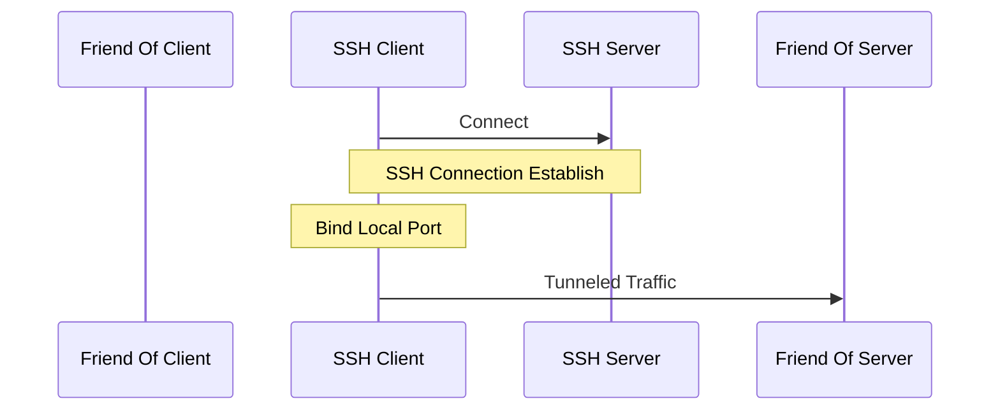
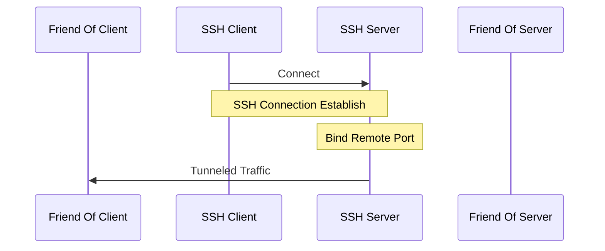
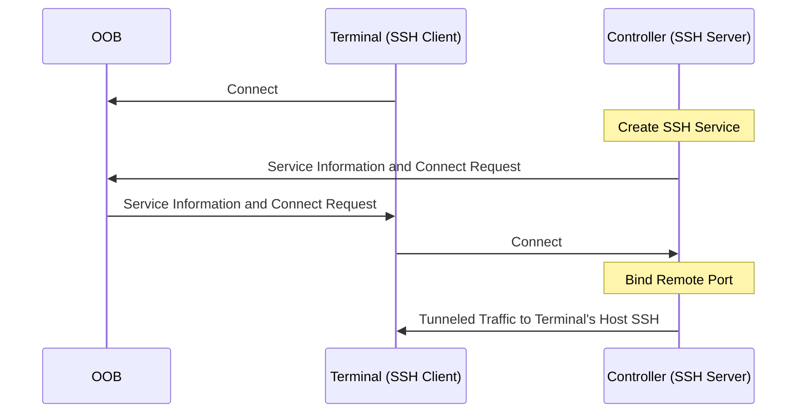

# Paramiko Tunnel

This article demonstrates how to use `Paramiko` as both an SSH client and server, enabling secure communication between systems without requiring host machines to provide or expose native SSH services. This approach offers flexibility and control over SSH functionality in various environments, such as IoT device management.

[Paramiko](https://www.paramiko.org/) is a pure-Python 1 (3.6+) implementation of the SSHv2 protocol 2, providing both client and server functionality.

## SSH Tunnel

### Local Port Forwarding


### Remote Port Forwarding



## Paramiko Tunnel

The following example uses `Remote Port Forwarding` to enable a controller to access a terminal device's SSH via Out-of-Band (OOB) communication, such as MQTT.



First, start the controller and create a SSH service
```
> python3 controller.py
[*] Bind Success for SSH Server using 0.0.0.0:53482
[*] Listening
```

Now we take the connection information (port 53482) for the terminal
```
python3 terminal.py controller_adress 53482 localhost 22
Connecting to ssh host controller_adress:53482 ...
Now forwarding remote port to localhost:22 ...
Connected!  Tunnel open ('127.0.0.1', 53486) -> ('x.x.x.x', 53482) -> ('localhost', 22)
```

On controller side, it spawn a SSH connection with the ssh tunnel port, which is redirected to the terminal.
```
[*] Incoming Connection from y.y.y.y:53588
Start forwarder on port 53589
[*] SSH Tunnel Port 53589
ssh localhost -p 53589
Enter passphrase for key '/Users/user/.ssh/id_rsa':
```

Between the paramiko server/client, a hard-coded `PSK_USERNAME` and `PSK_PASSWORD` pair is used to do the authentication.